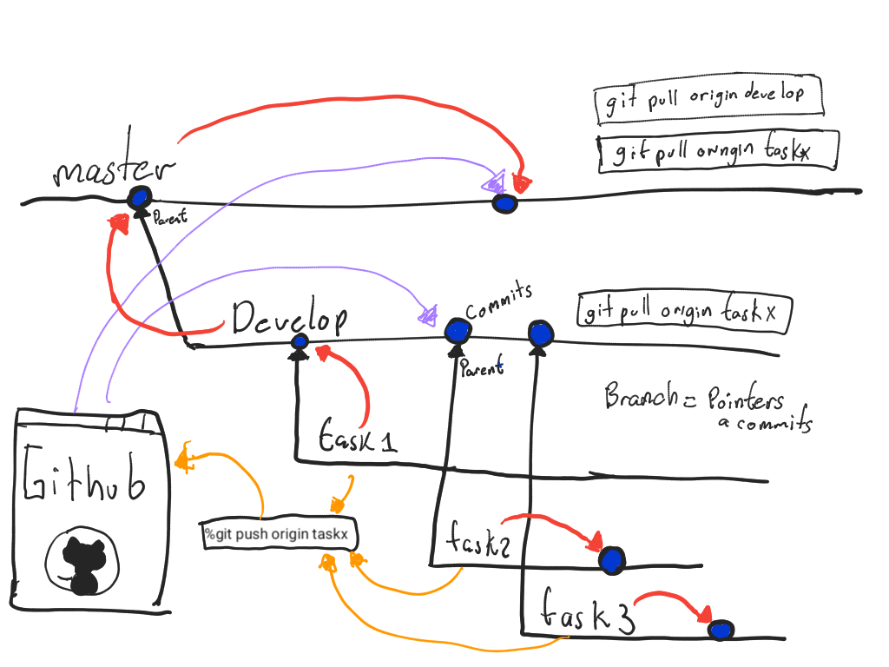
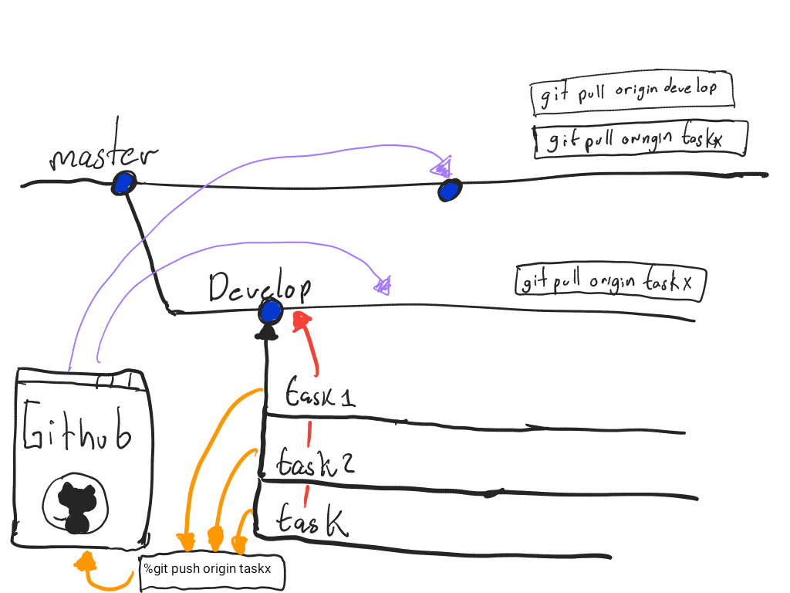
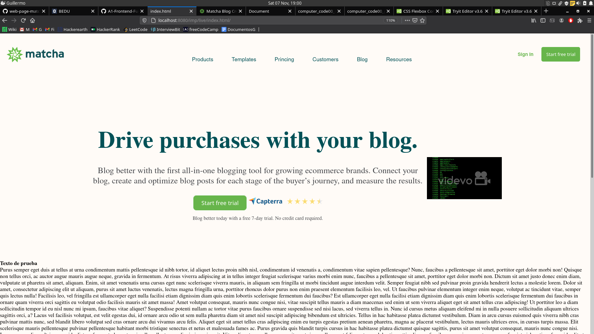
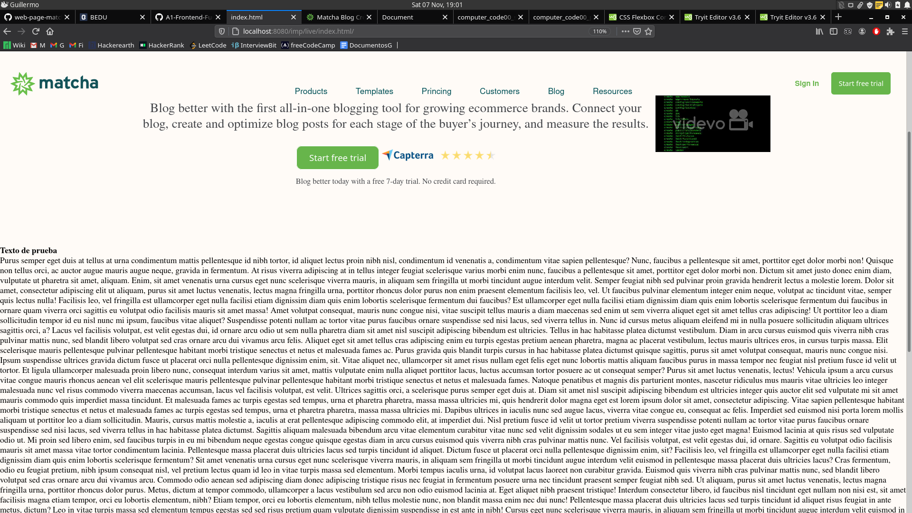
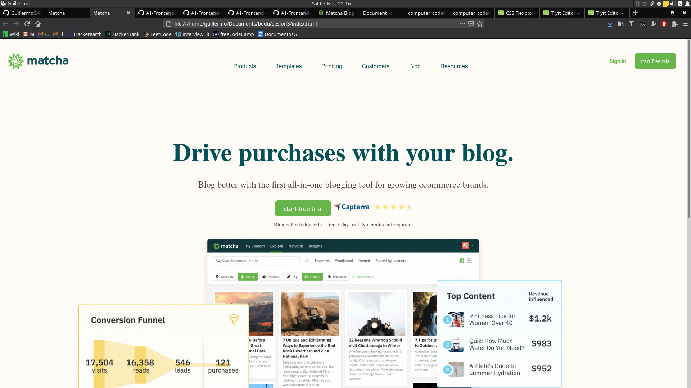
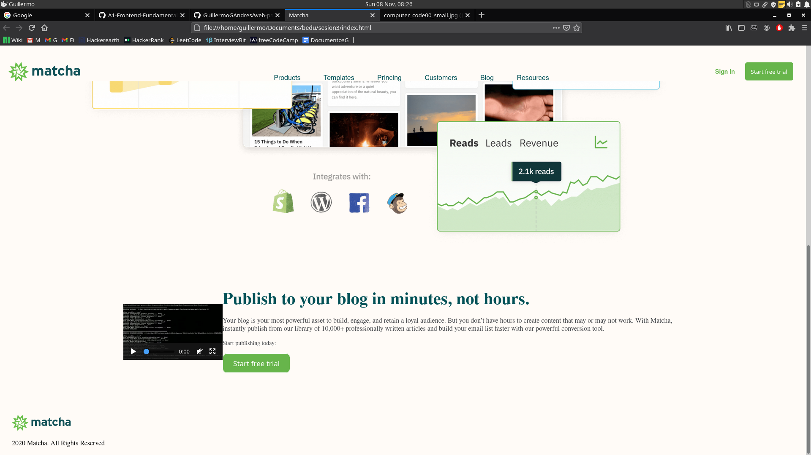
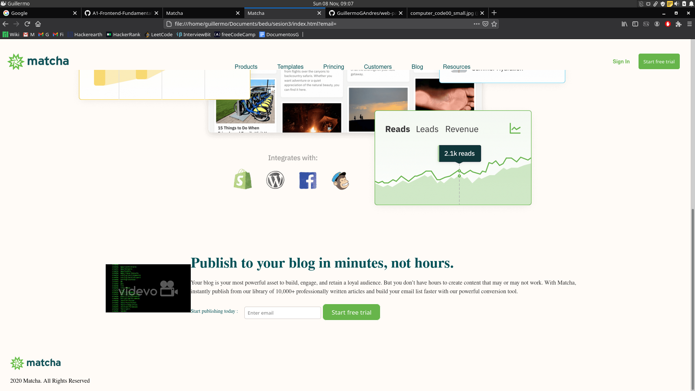
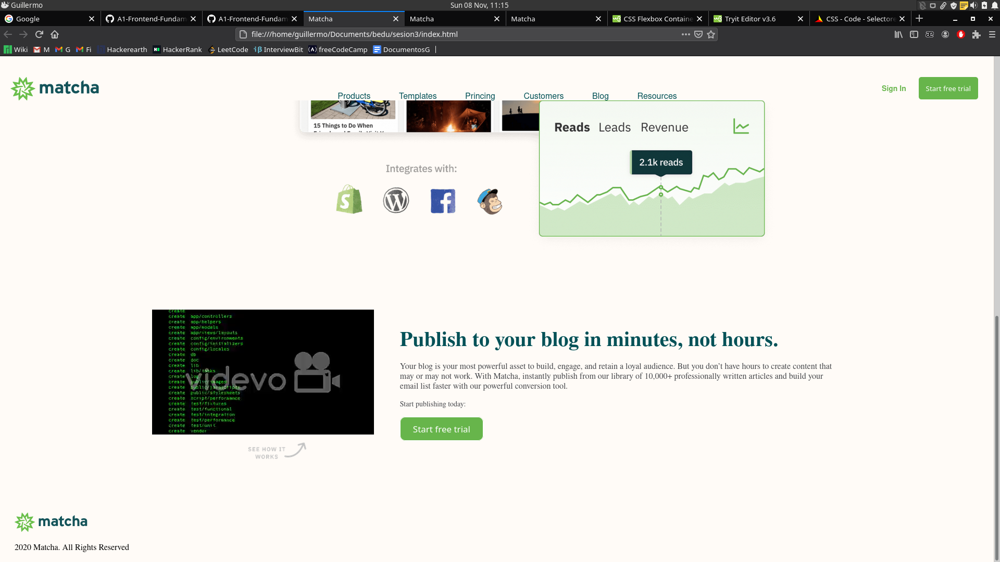

<!-- @reference: https://github.com/beduExpert/A1-Frontend-Fundamentals-Santander/tree/main/sesion-03 -->
# Barra navegacion, branches y video de nuestra pagina web 

## Progreso (Timeline)

Si quisiéramos que los flex items estén alineados al centro horizontalmente, esto se podría lograr con justify-content: center; siempre y cuando el flex-direction sea row.
Puesto que justify-content alinea a los flex items en el eje principal, mientras que align-items lo hace en el eje secundario. Por lo tanto, notar en el ejemplo anterior que si el flex-direction fuera column(vertical) para alinear horizontalmente, necesitaríamos usar la propiedad align-items.

## Tarea realizada por rama task1/001/MultimediaVideo "Agregacion de botones y portada al video"

## Tarea realizada por la rama task/002/Publicidad "Formulario y estilos en la seccion de publicidad"

## Tarea realizada por task3 "Agregando imagen y contenedor a la seccion de video"

